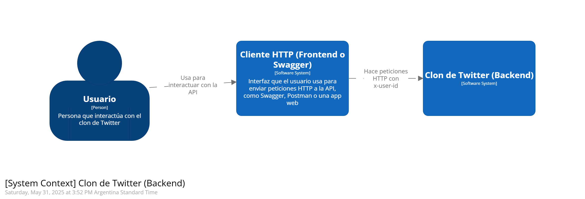
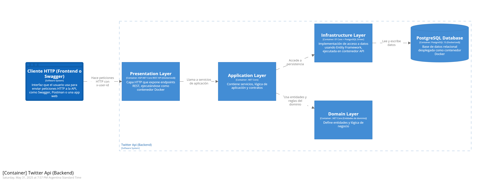
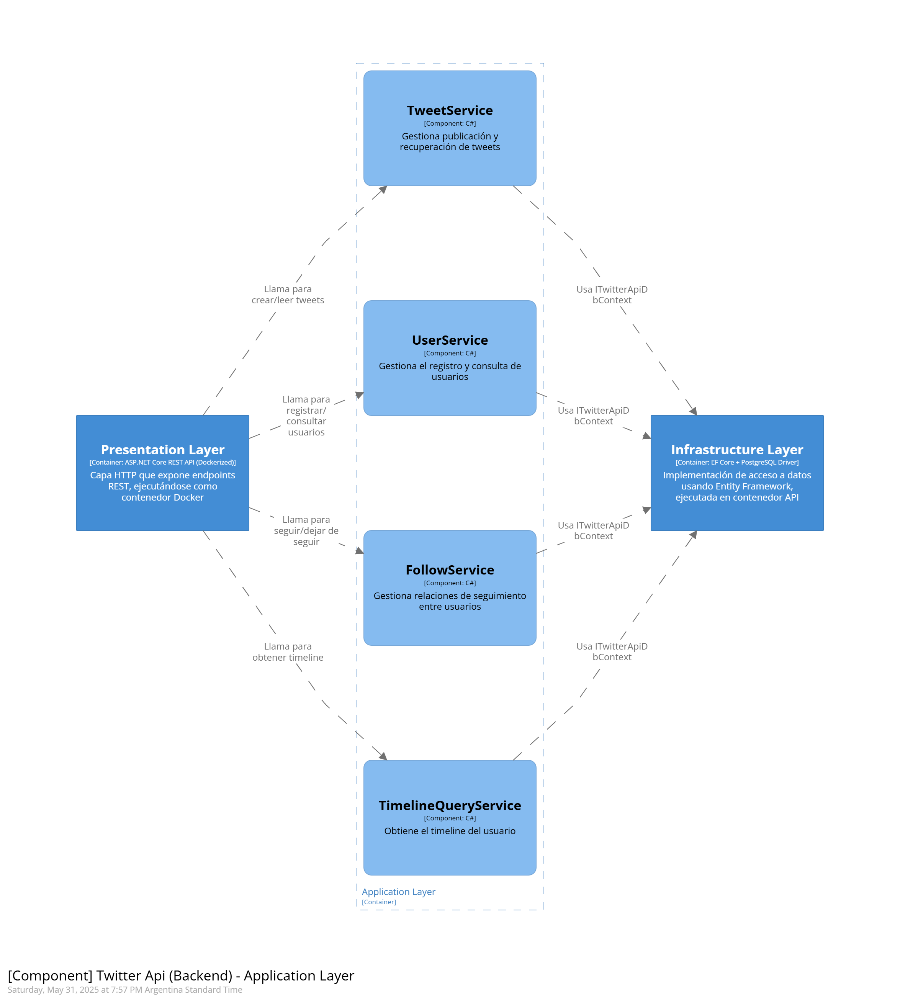

# 🐦 Twitter Clone

## Índice
1. [Descripción](#descripción)
2. [Supuestos técnicos y de negocio](#supuestos-técnicos-y-de-negocio)
3. [Tecnologías](#tecnologías)
4. [Arquitectura Base](#arquitectura-base)
5. [Optimización para Lectura](#optimización-para-lectura)
6. [Cómo levantar el proyecto](#cómo-levantar-el-proyecto)
7. [Estructura del proyecto](#estructura-del-proyecto)
8. [Propuesta de Escalabilidad - Ideal para Producción](#propuesta-de-escalabilidad---ideal-para-producción)

  
## Descripción
Aplicación backend que simula funcionalidades simplificadas de Twitter:
- Publicar tweets
- Seguir o dejar de seguir usuarios
- Ver un timeline con los tweets de los usuarios seguidos
- Endpoints para probar fácilmente el ejercicio.


## Supuestos técnicos y de negocio
1. Todos los usuarios son válidos y se identifican por un `userId` que llega por el header `x-user-id`.
2. No se implementa autenticación ni autorización. Pero se valida que el userId en los endpoints requeridos venga correctamente.
3. Todos los tweets son públicos.
4. Cada tweet tiene un máximo de 280 caracteres y un mínimo de 1 carácter.
5. El nombre de usuario (username) debe tener entre 4 y 15 caracteres, siguiendo la restricción actual de Twitter.
6. Un usuario puede seguir a múltiples usuarios sin restricciones.
7. No hay funcionalidades como likes, retweets ni comentarios.
8. El timeline solo incluye tweets de usuarios seguidos, ordenados por fecha descendente.
9. El timeline retorna los tweets de forma paginada, permitiendo al cliente solicitar bloques controlados de resultados mediante parámetros como `Page` y `PageSize`, optimizando así el uso de recursos y mejorando la escalabilidad de la API.
10. Se utilizará PostgreSQL no solo por la familiaridad del equipo, lo cual permite avanzar con mayor velocidad, sino también por sus sólidas capacidades para manejar consultas complejas, soporte robusto de índices y su compatibilidad con replicación nativa, lo que lo hace ideal para una arquitectura optimizada para lecturas.
11. No se contempla política de borrado de tweets ni de relaciones de follow (unfollow).
12. La API sigue el estilo REST y devuelve respuestas en formato JSON.
13. Todos los timestamps se almacenan en UTC.
14. No se implementan mecanismos de protección contra spam o abuso, dado que no hay un sistema de autenticación.
  
## Tecnologías
- .NET Core
- PostgreSql
- Docker (para levantar servicios en tu local)
- EF Core
- XUnit, Moq

## Arquitectura Base

Proyecto monolítico, limpio y desacoplado, basado en principios de Clean Architecture / DDD:
### Capas:
-  **Presentation**: endpoints REST
-  **Application**: casos de uso coordinando lógica
-  **Domain**: entidades como `Tweet`, `User`, `FollowRelationship`
-  **Infrastructure**: acceso a base de datos relacional


### Diagramas
A continuación se muestran graficamente el contexto del sistema, como interactuan las capas como contenedores y como interactuan los componentes mas importantes de negocio usando [Modelo C4](https://c4model.com/):








**Modelo UML**: diagrama de clases que representa las relaciones entre `User`, `Tweet`, y `FollowRelationship`.


## Optimización para Lectura
-  `.AsNoTracking()` en EF Core para evitar overhead
- Índices en `CreatedAt`, `UserId`, `FollowedUserId`
- Endpoint `GET /timeline` trae solo lo necesario con `Select`


## Cómo levantar el proyecto
#### Requisitos previos:
- Tener Docker y Docker Compose instalados.
- Puerto **5000** disponible en local.

  

#### Pasos:

1. Clonar el repo:
```bash
git  clone  https://github.com/lazarogabriel/twitter-api-mini-clone
cd  twitter-api-mini-clone
```

2. Levantar los servicios:
```bash
docker-compose  up  --build
```
Esto crea y levanta los contenedores para la API, la base de datos PostgreSQL.
La API estará disponible en `http://localhost:5000`

Podés probar los endpoints usando Postman o cURL, o acceder directamente a la documentación generada con Swagger en `http://localhost:5000/swagger`.

 
### Acceso a la base de datos desde Docker (sin PostgreSQL instalado)
Si no tenés PostgreSQL instalado localmente, podés acceder a la base de datos del proyecto directamente desde el contenedor de Docker para revisar las tablas, columnas y datos:

```bash
docker  exec  -it  twitter_db  bash

# Dentro del contenedor:
psql  -U  postgres  -d  TwitterMiniClone

# Comandos dentro de psql:
\dt        --  Ver  todas  las  tablas
\d users  --  Ver  la  estructura  de  la  tabla  'users'
\q         --  Salir  del  cliente  psql
exit       --  Salir  del  contenedor
```

> También podés usar pgAdmin conectando a `localhost:5432` con usuario y contraseña configurados en el docker-compose.yml.

## Estructura del proyecto
```
📁 src/
├── 01_Presentation
├── 02_Application
├── 03_Domain
└── 04_Infrastructure
📁 tests/
└── (Tests unitarios y de integración)
```

## Propuesta de Escalabilidad - Ideal para Producción

### Posibles mejoras:

- Separación de APIs de lectura y escritura (CQRS básico)
- Docker Compose con PostgreSQL, etc.
- PostgreSQL replicado (read replica configurada con `pg_basebackup`)